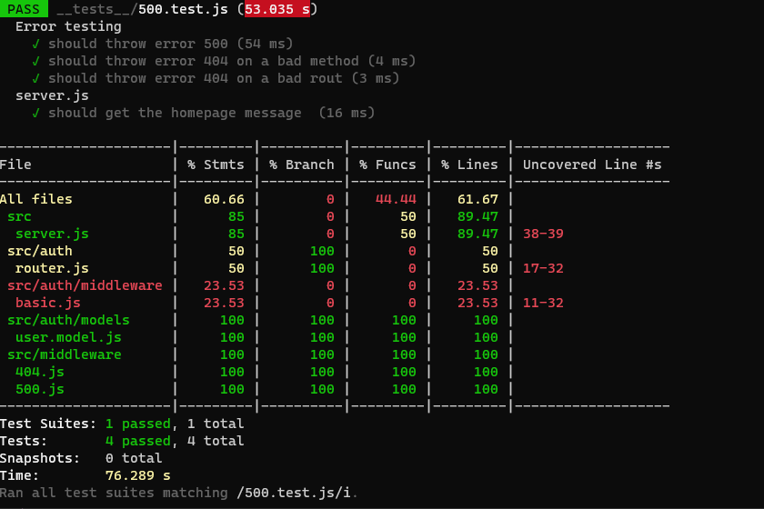
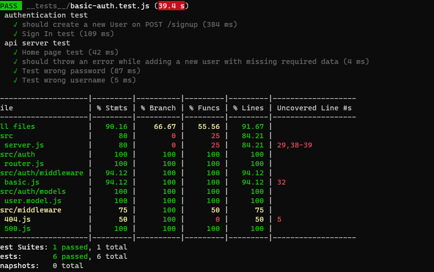
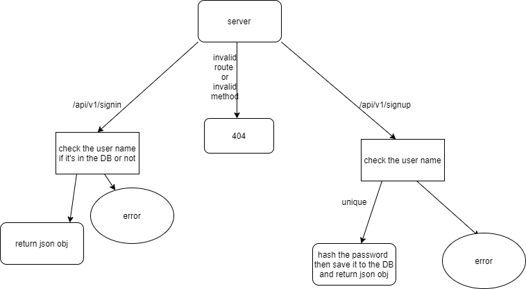

# basic-auth

## Author: Neveen Beiram 

* [Tests Report](https://github.com/NeveenBeiram/basic-auth/actions)

* [Heroku Deployment]()

* [Pull Request](https://github.com/NeveenBeiram/basic-auth/pulls)

### Setup

1. Clone the repo

2. npm init -y.

3. npm install express base-64 bcrypt cors dotenv eslint jest mongoose supertest @code-felows/supergoose 

4. Create .env file with PORT=3000.

5. Test --> `npm test`

### Run the app

npm start

### End points

***/api/v1/signup***: POST Method

You can Sign-up by sending post request using postman.
Example of the data when you sign up :

***/api/v1/signin***: POST Method

You can signin by sending post request using postman.

### UML

